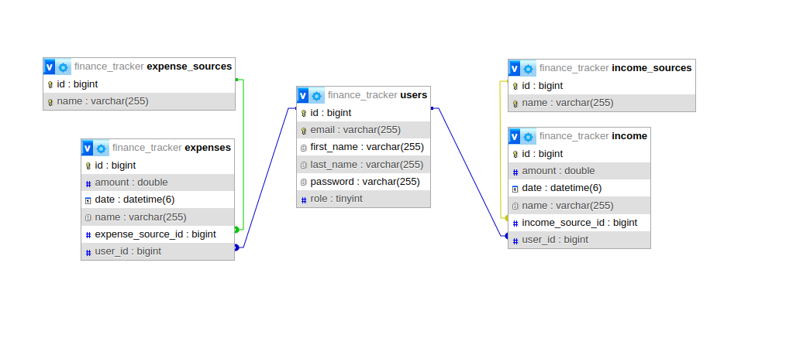

# Finance-tracker backend app

A finance-tracker app is a digital tool designed to help users manage and monitor their financial activities, expenses, and income. This app consists of:

- [frontend app (made in Vue)](https://github.com/kardahim/finance-tracker-frontend)
- backend app (made in Spring)
- database (mySql)

## Technology stack

This app uses:

- spring-boot-starter-data-jpa
- spring-boot-starter-validation
- spring-boot-starter-security
- spring-boot-starter-web
- mysql-connector-j
- lombok
- jjwt-api
- jjwt-impl
- jjwt-jackson
- commons-lang3
- spring-boot-starter-test

## Database

## Endpoints

The application has 5 modules. They are related to authorization and handling of income/expenses.

More in _[postman collection](./docs/finance-tracker.postman_collection.json)._

## Security

Application security is based on spring-security and jwt. In addition, the application uses user and administrator roles.
